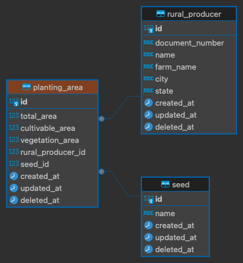

# Teste de Aptidão Python

## Requisitos para execução

Para executar o projeto é necessário ter o Docker instalado na máquina. Caso não tenha, siga as instruções de instalação no site oficial: <https://docs.docker.com/get-docker/>

## Execução

O Processo de execução do proejeto é quase todo automatizado, basta executar o comando abaixo:

### Ambiente de Produção

Se você deseja apenas executar o projeto em ambiente de produção, execute o comando abaixo:

#### Iniciar a aplicação

```bash
# PRODUÇÃO
docker-compose up app-prod --build
```

Acesse o Swagger em: <http://localhost:80/docs> </br>
assim que entrar na página, execute os seguintes passos:

- Execute o endpoint `POST /migrate` para criar as Tabelas da Base
- Execute o endpoint `POST /populate` para popular a base com dados de teste

### Ambiente de Desenvolvimento

Agora se você deseja executar o projeto em ambiente de desenvolvimento, execute o comando abaixo:

#### Iniciar a aplicação

```bash
# DESENVOLVIMENTO
docker-compose up app-dev --build
```

Acesse o Swagger em: <http://localhost:8000/docs> </br>
assim que entrar na página, execute os seguintes passos:

- Execute o endpoint `POST /migrate` para criar as Tabelas da Base
- Execute o endpoint `POST /populate` para popular a base com dados de teste

## Modelo de Banco de Dados

Exemplo abaixo:</br></br>

</br></br>
Descrição: Escolhi desenvolver o projeto dividindo as tabelas em 3 partes, sendo elas:

- `Produtores`: Tabela que armazena os dados do produtor rural
- `Áreas de cultivo`: Tabela que armazena os dados da fazenda do produtor
- `Sementes`: Tabela que armazena as culturas plantadas pelo produtor
  <br/><br/><b>Objetivo:</b> A divisão dessas tabelas de forma que um Produtor possa ter várias áreas de cultivo e cada área de cultivo possa ter várias sementes plantadas, foi feita para facilitar a manutenção e a escalabilidade do projeto.

## Tecnologias Utilizadas

Foram utilizadas as seguintes tecnologias para o desenvolvimento do projeto:

- FastAPI
- SQLAlchemy
- Docker
- PostgreSQL<br/>
  A escolha dessas tecnologias foi feita com base na facilidade de desenvolvimento e manutenção do projeto, além de serem tecnologias que estão em alta no mercado.

## Descrição do Desafio

O teste tem como objetivo acurar as habilidades do candidato em resolver alguns problemas relacionados à lógica de programação, regra de negócio e orientação à objetos.
O mesmo consiste em um cadastro de produtor rural com os seguintes dados:

- CPF ou CNPJ
- Nome do produtor
- Nome da Fazenda
- Cidade
- Estado
- Área total em hectares da fazenda
- Área agricultável em hectares
- Área de vegetação em hectares
- Culturas plantadas (Soja, Milho, Algodão, Café, Cana de Açucar)
